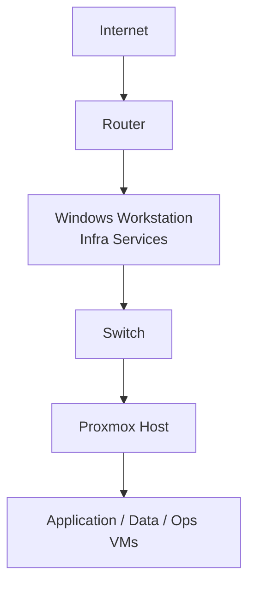

# Homelab Platform Foundation

> Foundational infrastructure for a reproducible, platform-oriented home lab environment.

---

## 📌 Purpose

This repository documents the foundational infrastructure powering my homelab environment.

The goal of this lab is to simulate real-world platform and infrastructure engineering practices, including:

- Network segmentation
- Internal service hosting
- Package management control
- Containerized infrastructure components
- Reproducible configuration
- Clear architectural documentation

This repository serves as the source of truth for the lab's core design decisions and infrastructure components.

---

## 🏗 High-Level Architecture



The Windows workstation hosts foundational services (e.g., internal APT cache) exposed to the isolated lab subnet.

Proxmox provides virtualization and workload isolation.

---

## 📂 Repository Structure

```
homelab-platform-foundation/
│
├── README.md
└── docs/
    ├── apt-caching.md
    ├── network-topology.md
    └── rebuild.md
```

### Documentation Modules

- **apt-caching.md**  
  Containerized internal APT caching infrastructure.

- **network-topology.md**  
  Subnet design, routing decisions, and architectural layout.

---

## 🧠 Design Philosophy

This homelab is built around several guiding principles:

### 1️⃣ Stability Over Convenience
Infrastructure components should expose predictable, stable endpoints.

### 2️⃣ Infrastructure as Documentation
Every significant component is documented clearly and reproducibly.

### 3️⃣ Realistic Architecture
The lab simulates enterprise patterns where possible:
- Internal services
- Network isolation
- Controlled outbound access
- Containerized infrastructure

### 4️⃣ Iterative Expansion
The foundation is intentionally minimal and designed to evolve.

---

## 🚀 Current Capabilities

- Internal APT caching proxy
- Isolated lab subnet (10.10.0.0/24)
- Containerized infrastructure services
- Proxmox-based virtualization platform

---

## 📈 Planned Expansion

Future modules may include:

- Internal DNS
- Reverse proxy + TLS
- Logging stack
- Monitoring stack
- Infrastructure-as-Code provisioning
- Data engineering platform components

---

## 🎯 Why This Exists

This homelab provides a controlled environment to:

- Experiment with platform architecture
- Practice operational troubleshooting
- Develop infrastructure documentation discipline
- Support data engineering workloads
- Build demonstrable infrastructure competency

---

## 📜 License

This repository is intended for educational and homelab use.