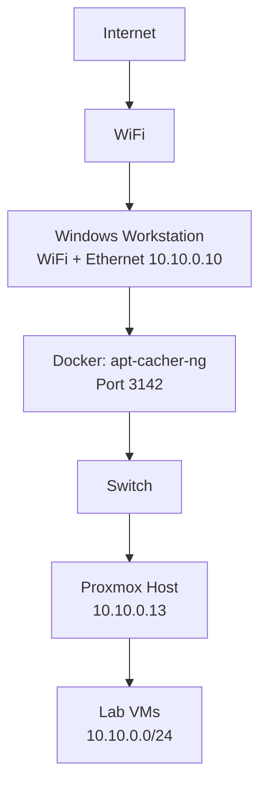

# Network-Topology
## 🏗 Architecture

---

## 🌐 Network Design

| Component        | IP Address      | Notes                      |
|------------------|----------------|----------------------------|
| Windows Ethernet | 10.10.0.10/24  | Static IP, no gateway      |
| Proxmox Host     | 10.10.0.13/24  | Uses APT proxy             |
| APT Proxy        | 10.10.0.10:3142| Docker container           |
| Lab Subnet       | 10.10.0.0/24   | Isolated internal network  |

---
